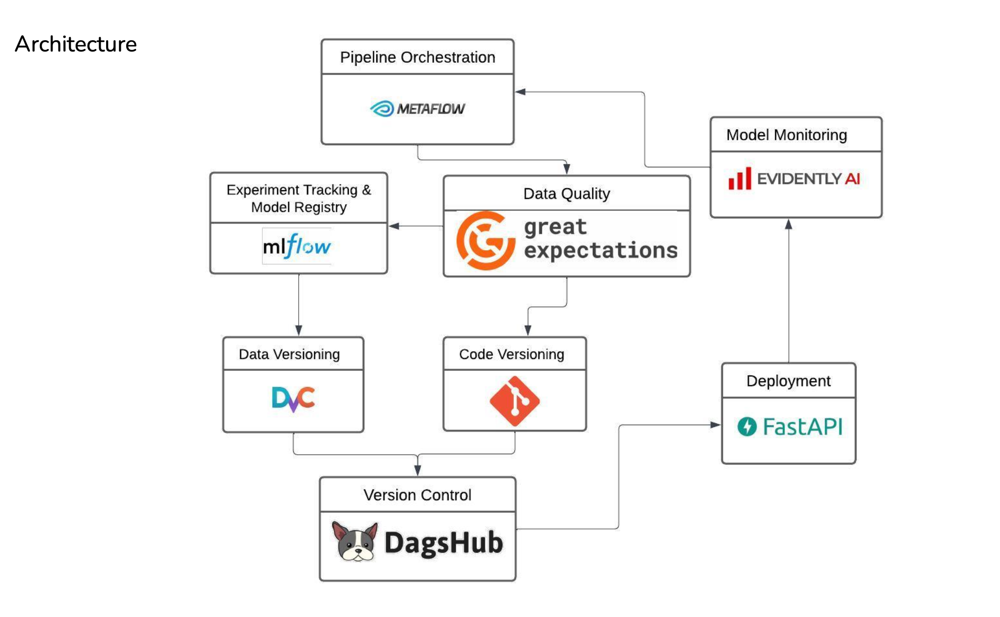

# MLOps Prototype for a simple Uber Price Prediction Model

## Introduction

This is a simple prototype for a MLOps pipeline for a simple Uber Price Prediction Model. The model is trained on the [Uber Fares Dataset](https://www.kaggle.com/datasets/yasserh/uber-fares-dataset) from Kaggle. The model is trained using Random Forest and Gradient Boosting models with various hyperparameters. The best model is then deployed using FastAPI. The model is then tested using a simple web app.

Many different tools are tested in process of building this pipeline. The tools used are mentioned in the Final Report. Different MLOps tools are compared and chosen for use case. 

## Architecture

